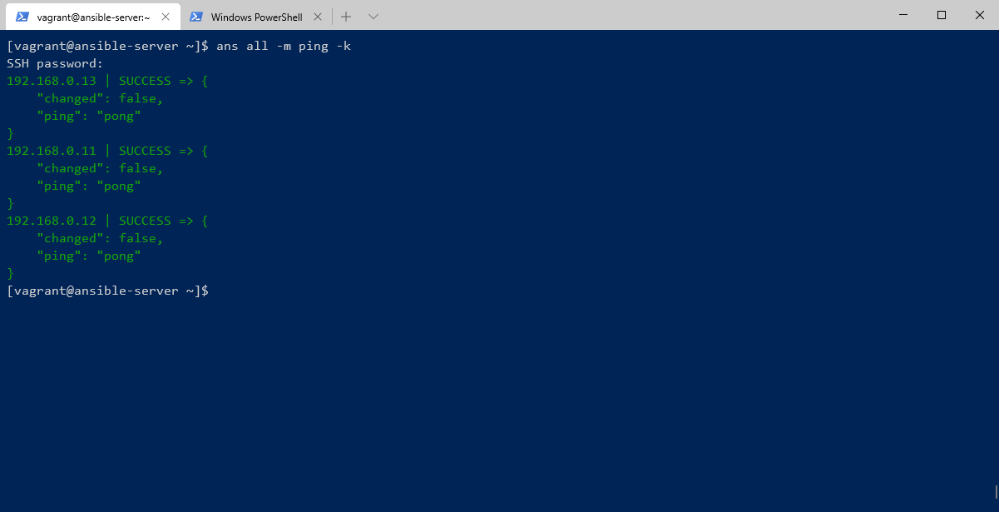

# 앤서블 서버와 노드 연결하기

이전 절에서 앤서블 서버와 노드를 구축했다. 그러나, 아직 앤서블 서버와 노드가 서로 연결되어 있는 상태가 아니다. 앤서블 서버 호스트 파일에 다음과 같이 핸들링 할 앤서블 노드를 추가해야 한다.


```bash
...

[CentOS]
192.168.0.11
192.168.0.12
192.168.0.13

```


이 정보를 ansible\_env\_ready.yml 파일에 다음과 같이 기록하여 프로비저닝 하도록 한다.   
작성이 완료되면, vagrant provision 명령어를 실행하여 앤서블 서버에 적용한다.


```yaml
---
- name: Setup for the Ansible's Environment
  hosts: localhost
  gather_facts: no

  tasks:
    - name: Add ansible host information
      blockinfile:
        path: /etc/ansible/hosts
        block: |
          [CentOS]
          192.168.0.11
          192.168.0.12
          192.168.0.13

... (중략)
```


그러나, 실제로 앤서블 서버에서 ans all -m ping 명령어를 입력하면 앤서블 노드의 응답을 전달 받지 못하는 것을 확인할 수 있다.  
베이그런트를 통해 설치된 CentOS는 정책 상 패스워드를 통해 SSH 연결을 하지 못하도록 막아놨다. 이에 대한 설정 값을 변경해야 한다.

각 앤서블 노드의 ssh 설정을 다음과 같이 변경해주어야 한다.


```bash
...
# 변경 전
PasswordAuthentication no

# 변경 후
PasswordAuthentication yes
```


이와 같이 변경하기 위해서는 직접 노드에 들어가서 ssh 설정 파일을 수정하는 것이 아니라, 베이그런트를 통해 프로비저닝 할 것이다. \(자동화의 목적을 달성하기 위해\)

먼저 위와 같이 적용 SSH 연결 시, 패스워드를 통한 인증을 진행할 수 있도록  이에 해당 하는 쉘 스크립트 파일을 작성한다.


```bash
#!/usr/bin/env bash

now=$(date +"%m_%d_%Y")
cp /etc/ssh/sshd_config /etc/ssh/sshd_config_$now.backup
sed -i -e 's/PasswordAuthentication no/PasswordAuthentication yes/g' /etc/ssh/sshd_config
systemctl restart sshd
```


Vagrant 파일을 열어 각 앤서블 노드의 마지막 부분에 다음과 같이 쉘스크립트를 실행할 수 있도록 등록한다.


```ruby
 ...
   # Ansible-Node1
  config.vm.define "ansible-node1" do |cfg|
    cfg.vm.box = "centos/7"
    cfg.vm.provider "virtualbox" do |vb|
      vb.name = "Ansible-Node01"
    end
    cfg.vm.host_name = "ansible-node01"
    cfg.vm.network "public_network", ip: "192.168.0.11"
    cfg.vm.network "forwarded_port", guest: 22, host: 60011, auto_correct: true, id: "ssh"
    cfg.vm.synced_folder "../data", "/vagrant", disabled: true
    cfg.vm.provision "shell", path: "bash_ssh_conf_4_CentOS.sh" # 추가된 부분
  end
...
```


vagrant provision 명령을 통해 해당 SSH 설정을 적용한다.

앤서블 서버에 SSH로 접속하여 다음 입력을 통해, known\_hosts 에 등록한다.

```ruby
ans all -m ping
```


앤서블 서버에 접속\(vagrant ssh ansible-server\) 한 후, 다음 명령어를 실행하면 앤서블 노드들과 정상적으로 통신이 되는 것을 확인할 수 있다.



하지만, 앤서블 서버에 직접 SSH 접속하여 CLI를 입력하는 것은 바람직하지 않다.  
이또한, 베어그런트를 이용하여 프로비저닝하도록 변경한다.

  
먼저 sshpass 모듈을 구동할 수 있도록 앤서블 플레이북 YAML 파일에 패키지를 설치 명령을 작성한다.


```yaml
  ...
      - name: Install sshpass for Authentication
      yum:
        name: sshpass
        state: present
  ...
```


그 다음 known\_hosts 등록을 할 수 있도록 쉘 스크립트를 작성하도록 한다.


```bash
#!/usr/bin/env bash

sshpass -p vagrant ssh -T -o StrictHostKeyChecking=no vagrant@192.168.0.11
sshpass -p vagrant ssh -T -o StrictHostKeyChecking=no vagrant@192.168.0.12
sshpass -p vagrant ssh -T -o StrictHostKeyChecking=no vagrant@192.168.0.13
```


위에서 작성한 쉘 스크립트 파일을 ansible-server 가상 머신에 프로비저닝 하도록 작성한다.


```ruby
...
    # Ansible-Server
  config.vm.define "ansible-server" do |cfg|
    cfg.vm.box = "centos/7"
    cfg.vm.provider "virtualbox" do |vb|
      vb.name = "Ansible-Server"
    end
    cfg.vm.host_name = "ansible-server"
    cfg.vm.network "public_network", ip: "192.168.0.10"
    cfg.vm.network "forwarded_port", guest: 22, host: 60010, auto_correct: true, id: "ssh"
    cfg.vm.synced_folder "../data", "/vagrant", disabled: true
    cfg.vm.provision "shell", inline: "yum install ansible -y"
    cfg.vm.provision "file", source: "ansible_env_ready.yml", destination: "ansible_env_ready.yml"
    cfg.vm.provision "shell", inline: "ansible-playbook ansible_env_ready.yml"
    cfg.vm.provision "shell", path: "add_ssh_auth.sh", privileged: false # 추가된 부
  end
```


이제 베이그런트의 프로비저닝 명령어를 실행하여 이를 적용하도록 한다.   
\(vagrant provision ansible-server\)  
명령의 stdout 출력이 끝날 즈음에, known\_hosts 등록이 완료된 것을 확인할 수 있다.


이제는 known\_hosts 등록을 수동으로 등록하지 않아도 앤서블 노드와 연결되는 것을 확인할 수 있다.


